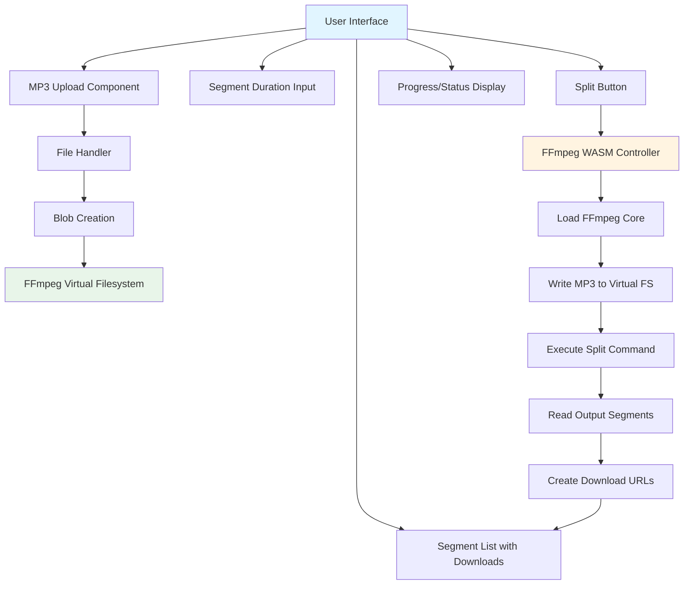
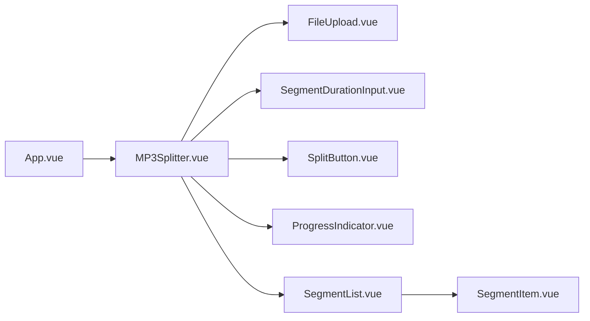

# MP3 Splitter Application - Implementation Plan

## Overview
A Vue 3 application that allows users to upload MP3 files and split them into segments using FFmpeg WASM. Users can specify the segment duration in seconds, and the application will display all generated segments with individual download buttons.

## Technology Stack
- **Framework**: Vue 3 with Composition API (TypeScript)
- **Build Tool**: Vite
- **Audio Processing**: FFmpeg WASM (@ffmpeg/ffmpeg, @ffmpeg/util)
- **Language**: TypeScript

## Architecture



## Component Structure



## Core Features

### 1. MP3 Upload Component
- Drag and drop support
- File input button
- File validation (MP3 format only)
- Display file name and size
- Convert uploaded file to Blob

### 2. Segment Duration Input
- Number input field for seconds
- Validation: minimum 1 second
- Preset buttons for common durations (3s, 5s, 10s, 30s)
- Visual feedback for invalid input

### 3. FFmpeg WASM Integration
- Load FFmpeg core on demand (lazy loading)
- Use multithreaded version for better performance
- Handle loading states and errors
- Write uploaded MP3 to virtual filesystem
- Execute split command: `ffmpeg -i input.mp3 -f segment -segment_time {duration} -c copy out%03d.mp3`
- Read output segments from virtual filesystem

### 4. Segment Management
- Detect number of generated segments
- Create Blob URLs for each segment
- Display segments in a list with:
  - Segment number/name
  - File size
  - Download button
- Allow individual downloads
- Option to download all segments

### 5. Progress & Status
- Loading FFmpeg core indicator
- Processing progress during split operation
- Success/error messages
- Estimated time remaining (if available)

### 6. Error Handling
- Invalid file format
- FFmpeg loading failures
- Split operation errors
- Browser compatibility issues
- Memory limit warnings

## Implementation Details

### File: `src/components/MP3Splitter.vue` (Main Component)

**State Management:**
```typescript
- uploadedFile: Ref<File | null>
- segmentDuration: Ref<number>
- isProcessing: Ref<boolean>
- ffmpegLoaded: Ref<boolean>
- segments: Ref<Segment[]>
- statusMessage: Ref<string>
- errorMessage: Ref<string>
```

**Key Methods:**
```typescript
- handleFileUpload(file: File): void
- validateFile(file: File): boolean
- loadFFmpeg(): Promise<void>
- splitMP3(): Promise<void>
- readSegments(): Promise<Segment[]>
- downloadSegment(segment: Segment): void
- downloadAllSegments(): void
- reset(): void
```

### FFmpeg Command Structure

The split command will be constructed dynamically:
```bash
ffmpeg -i input.mp3 -f segment -segment_time {duration} -c copy out%03d.mp3
```

Where:
- `{duration}` = user-specified segment time in seconds
- `out%03d.mp3` = output pattern (out001.mp3, out002.mp3, etc.)

### Segment Data Structure

```typescript
interface Segment {
  id: number
  name: string
  blob: Blob
  url: string
  size: number
  duration?: number
}
```

## UI Layout

```
┌─────────────────────────────────────────┐
│         MP3 Splitter Application        │
├─────────────────────────────────────────┤
│                                         │
│  ┌─────────────────────────────────┐   │
│  │   Drag & Drop MP3 File Here     │   │
│  │   or Click to Browse            │   │
│  └─────────────────────────────────┘   │
│                                         │
│  Selected: filename.mp3 (3.5 MB)       │
│                                         │
│  Segment Duration: [ 3 ] seconds       │
│  Presets: [3s] [5s] [10s] [30s]         │
│                                         │
│  [ Split MP3 ]                          │
│                                         │
│  Status: Processing...                  │
│  Progress: ████████░░ 80%               │
│                                         │
│  Generated Segments:                   │
│  ┌─────────────────────────────────┐   │
│  │ 1. out001.mp3 (1.2 MB) [Download]│   │
│  │ 2. out002.mp3 (1.2 MB) [Download]│   │
│  │ 3. out003.mp3 (1.1 MB) [Download]│   │
│  └─────────────────────────────────┘   │
│                                         │
│  [ Download All Segments ]              │
│                                         │
└─────────────────────────────────────────┘
```

## Performance Considerations

1. **Lazy Loading**: Load FFmpeg WASM only when needed (on first split operation)
2. **Memory Management**: Clean up Blob URLs after use to prevent memory leaks
3. **Progress Updates**: Use FFmpeg log events to provide real-time feedback
4. **Large Files**: Add warning for files > 50MB (browser memory limitations)
5. **Worker Threads**: Use multithreaded FFmpeg core for better performance

## Browser Compatibility

- Chrome/Edge 90+
- Firefox 88+
- Safari 14.1+
- Requires SharedArrayBuffer support (needs proper headers in production)

## Security Considerations

- Validate file types on both client and server (if backend added)
- Sanitize file names
- Limit file size to prevent DoS
- Clean up virtual filesystem after operations

## Future Enhancements (Optional)

- Audio preview/playback before download
- Merge segments back together
- Custom output naming
- Batch processing multiple files
- Export as ZIP
- Visual waveform display
- Precise time-based splitting (start/end times)

## Implementation Steps

1. ✅ Gather project context and requirements
2. ✅ Create detailed implementation plan
3. ⏳ Update FFmpegDemo.vue component with MP3 upload functionality
4. ⏳ Add segment duration input field with validation
5. ⏳ Implement FFmpeg WASM loading and initialization
6. ⏳ Implement MP3 file handling (write to FFmpeg virtual filesystem)
7. ⏳ Implement FFmpeg split command execution with user-specified duration
8. ⏳ Read and process output segments from FFmpeg virtual filesystem
9. ⏳ Create segment list display component with download buttons
10. ⏳ Add progress indicators and status messages
11. ⏳ Test the complete workflow (upload → split → download)
12. ⏳ Add error handling and user feedback

## Notes

- The existing `FFmpegDemo.vue` shows the basic pattern for FFmpeg WASM usage
- We'll refactor this component to be the MP3 splitter
- Use the same CDN for FFmpeg core: `https://cdn.jsdelivr.net/npm/@ffmpeg/core-mt@0.12.10/dist/esm`
- Follow Vue 3 Composition API patterns with TypeScript
- Maintain clean, component-based architecture for maintainability
